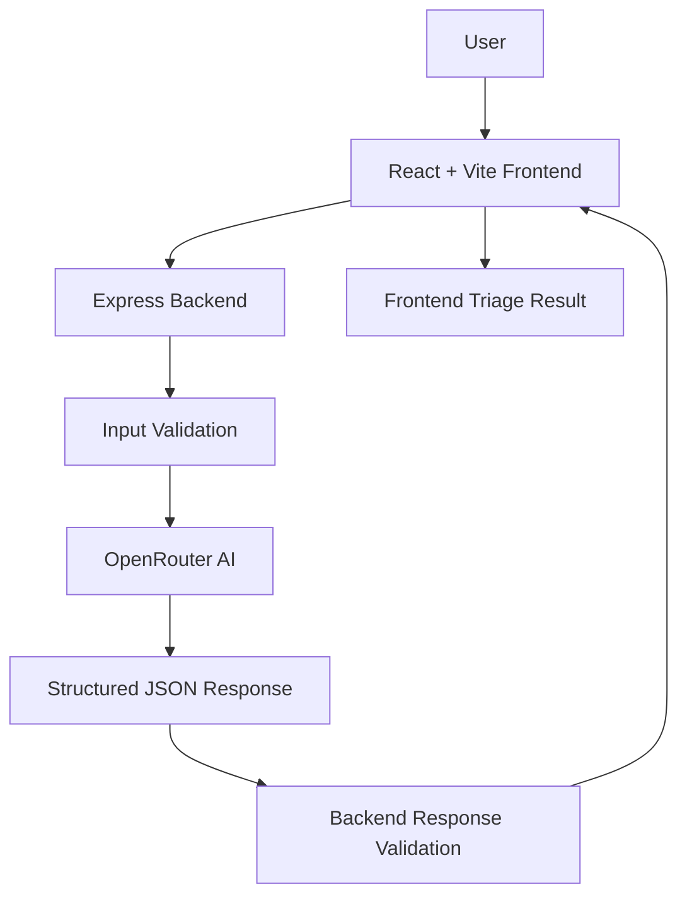
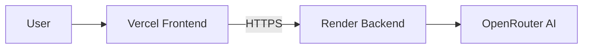

# 🤖 AI IT Support Triage Assistant

This application converts short, incomplete, or ambiguous IT support requests into structured, actionable triage information. It helps classify the issue, estimate urgency, identify missing information, recommend the next step, and decide whether a follow-up question is necessary instead of guessing.

- Live Demo: https://ai-it-support-triage.vercel.app
- GitHub: https://github.com/pandeyrudrashekhar-cmd/ai-it-support-triage

---

## 🎯 Problem Statement
IT support requests are often short, incomplete, and missing details needed for reliable diagnosis. Support teams need a faster, clearer way to turn a raw ticket into actionable triage data without making unsupported assumptions.

This project helps by converting a user-submitted ticket into structured guidance that answers:
- What is the issue?
- How urgent is it?
- What information is still missing?
- What should happen next?
- Why is that the best next step?
- Should the system ask a follow-up question instead of guessing?

---

## 💡 Solution Overview
The application follows a simple full-stack flow:

1. A user enters an IT support ticket in the React frontend.
2. The frontend sends the ticket to the Express backend.
3. The backend validates the input.
4. The backend sends the ticket to OpenRouter.
5. The AI returns structured triage data.
6. The backend validates and normalizes the response.
7. The frontend displays the result.

The system is designed to distinguish between known facts, plausible causes, and missing information rather than inventing unsupported details. When important information is missing, it identifies the gap and asks a targeted follow-up question.

---

## ✨ Key Features
- IT support ticket triage
- Required issue categories:
  - Network
  - Account
  - Application
  - Device
  - Other
- Required priority levels:
  - Low
  - Medium
  - High
  - Critical
- Confidence score
- Issue summary
- Missing-information detection
- Recommended next troubleshooting step
- AI reasoning/explanation
- Follow-up question when more context is needed
- Support for ambiguous or incomplete tickets
- Input validation
- API error handling
- Production deployment
- Responsive frontend user experience

---

## 🏗️ System Architecture



### Layer Responsibilities
- Frontend: ticket entry, request submission, result rendering
- Backend: request handling, validation, OpenRouter integration, response normalization
- OpenRouter: AI-driven triage classification
- Validation layer: ensures the AI output matches the required schema before returning it

---

## 🔄 Application Flow

1. The user enters a support ticket.
2. The frontend sends the request to the backend.
3. The Express backend validates the ticket.
4. The backend sends the ticket to OpenRouter.
5. The AI returns a structured triage response.
6. The backend validates and parses the AI response.
7. The frontend renders the result.
8. If the ticket is incomplete, the UI presents a relevant follow-up question.

---

## 🧠 AI Triage Logic

The AI response is structured rather than free-form. The response contains these fields:

- `category`
- `priority`
- `confidence`
- `summary`
- `missingInformation`
- `nextStep`
- `reason`
- `needsFollowUp`
- `followUpQuestion`

The assistant avoids unsupported assumptions. When important information is missing, it identifies the missing context and asks a targeted follow-up question instead of guessing. The `reason` field is the user-facing explanation for the decision and recommended next step.

---

## 📋 Example

Example input:

```text
My laptop is connected to Wi-Fi but I can't access any websites. Teams isn't working either. I have a client call in 20 minutes.
```

Representative example result:

- Category: Network
- Priority: High
- Confidence: moderate to high based on the evidence available
- Summary: The issue appears to be connectivity related and affecting access to core services.
- Missing information: Whether the issue affects other devices on the same network and whether a VPN or proxy is required.
- Next step: Verify whether other devices on the same network are affected and isolate the issue to this device.
- Reason: The ticket describes an internet access problem with immediate business impact and a time-sensitive use case.
- Follow-up: Yes, if the user can confirm whether the problem affects only this device or the wider network.

This is an example only and does not claim the exact AI output is deterministic for every run.

---

## 📁 Project Structure

```text
ai-it-support-triage/
├── client/
│   ├── public/
│   ├── src/
│   ├── package.json
│   ├── vite.config.js
│   └── .env.example
├── server/
│   ├── controllers/
│   ├── routes/
│   ├── services/
│   ├── app.js
│   ├── server.js
│   ├── package.json
│   └── .env.example
├── .gitignore
├── README.md
└── .gitignore
```

### Key Directories
- `client/` — React frontend application
- `server/` — Express backend service
- `controllers/` — request validation and triage handling
- `routes/` — API routing
- `services/` — AI triage logic and response processing

---

## 🛠️ Tech Stack

### Frontend
- React
- Vite
- Tailwind CSS
- lucide-react

### Backend
- Node.js
- Express
- CORS
- dotenv

### AI
- OpenRouter
- Current configured model: `openai/gpt-4o-mini`

---

## 🔐 Security & Configuration

- The OpenRouter API key is kept on the backend.
- API keys are stored through environment variables.
- `.env` files are ignored by Git.
- Secrets are never committed to the repository.
- The frontend uses `VITE_API_URL`.
- The backend uses `CLIENT_URL` for CORS.
- The OpenRouter API key is never placed in frontend code.

No real secret values are included in this repository.

---

## ⚙️ Environment Variables

### Frontend
```env
VITE_API_URL=http://localhost:5000/api
```

### Backend
```env
OPENROUTER_API_KEY=your_openrouter_api_key
OPENROUTER_MODEL=openai/gpt-4o-mini
CLIENT_URL=http://localhost:5173
```

Production environment variables should be configured in the deployment platform and must not be committed to the repository.

---

## 🚀 Local Setup

### Frontend
```bash
cd client
npm install
npm run dev
```

### Backend
```bash
cd server
npm install
npm run dev
```

The frontend and backend run separately during local development.

---

## 🔌 API Endpoints

### `GET /api/health`
Returns the backend health status.

### `POST /api/triage`
Accepts an IT support ticket and returns structured triage information.

Example request body:

```json
{
  "ticket": "My internet is not working."
}
```

---

## 🎯 Challenge Requirement Coverage

| Requirement | Implementation |
| --- | --- |
| Issue category | Network / Account / Application / Device / Other |
| Priority | Low / Medium / High / Critical |
| Missing information | AI identifies missing context |
| Next step | Recommended troubleshooting action |
| Reasoning | User-facing explanation |
| Insufficient information | Relevant follow-up question |

The project supports the five official sample scenarios:
- Ticket 01 — Wi-Fi connected but websites and Teams are unavailable
- Ticket 02 — Password changed and Outlook repeatedly requests a password
- Ticket 03 — Laptop is extremely slow
- Ticket 04 — Connectivity issues after password change
- Ticket 05 — Internet is down

---

## 🧪 Testing & Validation

The project has been validated against:
- Official five challenge scenarios
- Ambiguous and incomplete tickets
- Empty or invalid ticket input
- Oversized ticket input
- AI provider failure handling
- Backend health checks
- Frontend and backend integration
- CORS configuration
- Production deployment verification

---

## 🌐 Deployment



### Live Deployment Links
- Frontend: https://ai-it-support-triage.vercel.app
- Backend: https://ai-it-support-triage.onrender.com
- GitHub: https://github.com/pandeyrudrashekhar-cmd/ai-it-support-triage

The frontend and backend are deployed separately, which keeps the AI credentials on the server side.

---

## 💭 Design Decisions

### Structured AI output
A fixed response structure makes the data predictable and easy for the frontend to consume.

### Follow-up questions
Incomplete tickets should not lead to confident guesses. The system identifies missing information and asks a relevant question when needed.

### Backend AI integration
The OpenRouter API key stays on the backend rather than being exposed in browser-side code.

### Confidence
Confidence provides an additional signal about how strongly the available ticket information supports the classification.

### Separation of frontend and backend
Separate deployment layers allow the AI credentials to remain server-side while preserving independent hosting.

---

## ⚠️ Limitations

- AI output depends on the quality and completeness of the ticket.
- The assistant provides troubleshooting guidance rather than directly modifying the user’s device.
- It does not currently integrate with enterprise ITSM platforms.
- The Render instance may experience cold-start delays after inactivity.

---

## 🔮 Future Improvements

The following are identified future work and are not current features:
- Knowledge-base/RAG integration
- Ticket history
- Enterprise ITSM integrations
- Authentication and role-based access
- Duplicate-ticket detection
- SLA-aware prioritisation
- Feedback-based triage improvement
- Analytics

---

## 👨‍💻 Author

Rudra Shekhar Pandey
B.Tech — Computer Science & Engineering
